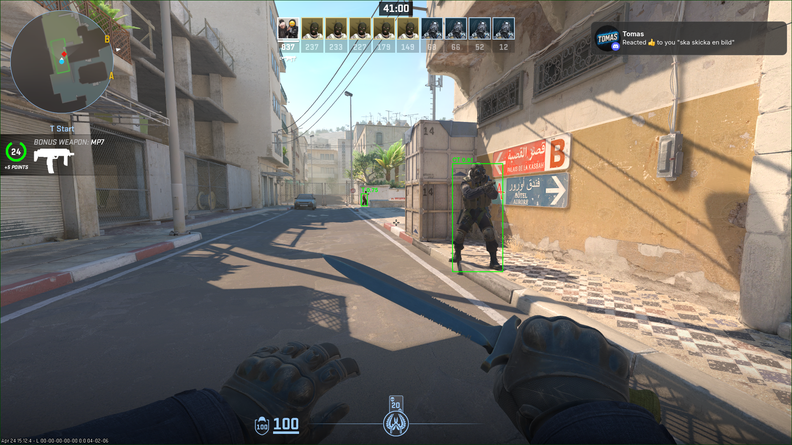
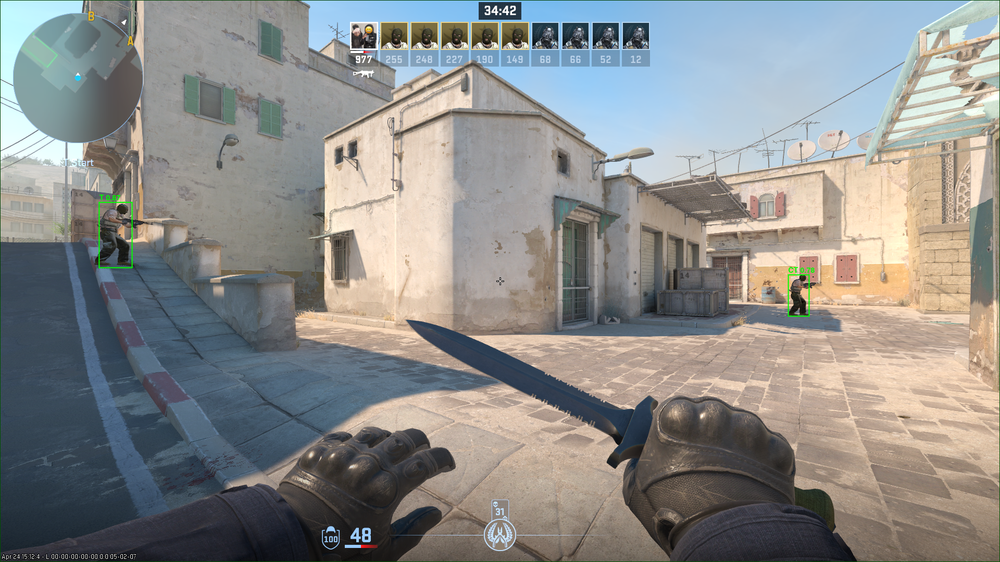
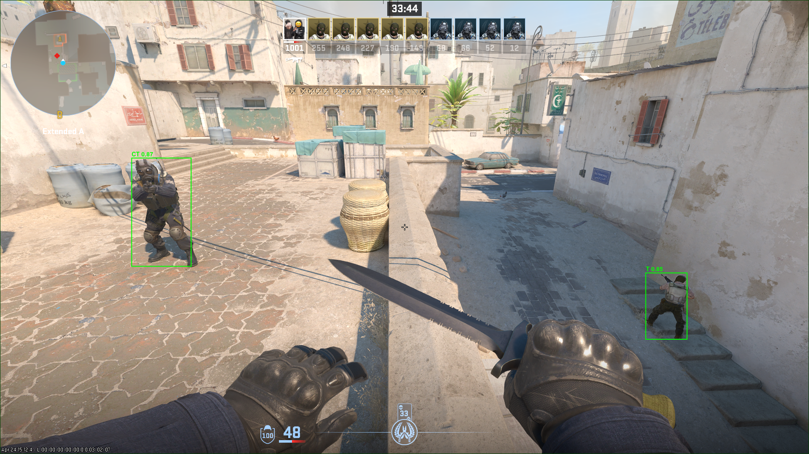
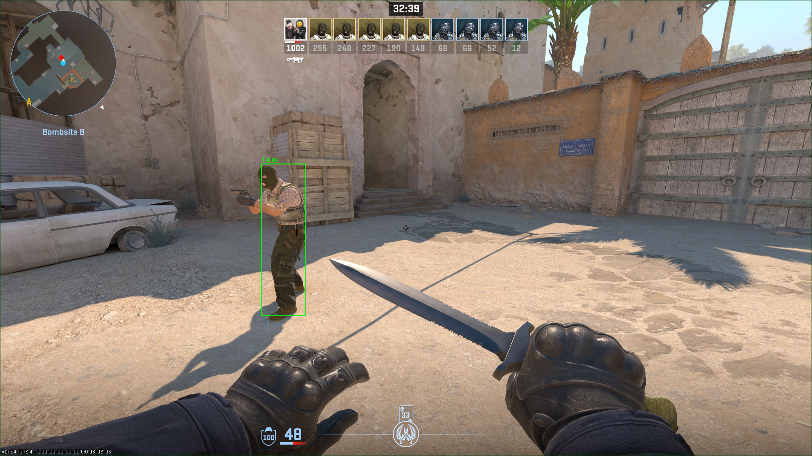

# Counter-Strike Player Detection

Real-time **Counter-Strike 2** player detection powered by a custom-trained
YOLO model. The project ships both a Jupyter training pipeline and a live
Linux Wayland overlay that draws bounding boxes on top of the running game.

---

## Preview

| | |
|---|---|
|  |  |
|  |  |


The green boxes are drawn live by the overlay as the model runs inference on
each captured frame.

---

## How it works

1. **Capture** &mdash; `grim` grabs the current frame from the chosen Wayland
   output (`DP-1` by default).
2. **Inference** &mdash; the captured frame is fed through a YOLOv5 model
   (`models/best_yolov5.pt`) running on the GPU.
3. **Render** &mdash; a transparent, click-through GTK4 layer-shell window
   sits on the `OVERLAY` layer and paints bounding boxes with their class
   and confidence directly over the game.

The detect loop runs on a worker thread and pushes results back to the GTK
main loop via `GLib.idle_add`, so drawing stays smooth while the model is
crunching the next frame.

## Model

The model in `models/best_yolov5.pt` was trained on two Roboflow datasets:

- **[CS2 Object Detection](https://app.roboflow.com/jagers-workspace/cs2-object-detection-6lnb5/overview)** &mdash; classes `CT`, `T`
- **[CSGO Train YOLOv5](https://app.roboflow.com/jagers-workspace/csgo-train-yolo-v5-u8bfj/overview)** &mdash; classes `CT`, `T`, `person`

The full training pipeline is reproducible from `detection.ipynb`.

`segmentation.ipynb` is just a notebook where i tested object segmentation
which I thought I would leave in. It colored the whole player model instead
of just putting a box around it, but it was way slower and needed more compute power.

## Project layout

```
CounterStrike-Player-Detection/
├── main.py              # Live overlay (GTK4 + layer-shell + YOLO)
├── detection.ipynb      # Detection model training
├── segmentation.ipynb   # Segmentation model training
├── models/
│   └── best_yolov5.pt   # Best detection checkpoint
└── previews/            # Screenshots of the overlay in action
```

## Requirements

- Linux with a Wayland compositor that supports `wlr-layer-shell`
  (Hyprland, Sway, etc.)
- `grim` for screen capture
- `gtk4-layer-shell` (the overlay preloads `/usr/lib/libgtk4-layer-shell.so`)
- Python 3 with `ultralytics`, `opencv-python`, `numpy`, `PyGObject`, `pycairo`
- An NVIDIA GPU with CUDA or an AMD GPU with ROCm for real-time inference

## Running the overlay

```bash
python main.py
```

Edit the constants at the top of `main.py` to match your setup:

```python
MODEL_PATH       = "models/best_yolov5.pt"
MODEL_CONFIDENCE = 0.6
OUTPUT_MONITOR   = "DP-1"
MONITOR_SIZE     = (1920, 1080)
```

The overlay is click-through, so it never steals input from the game.
Stop it with `Ctrl+C` in the terminal that launched it.
